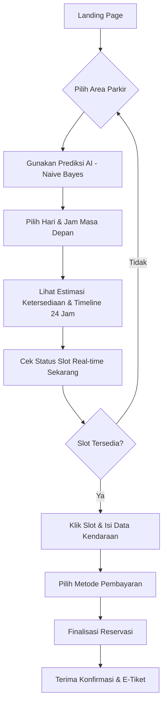
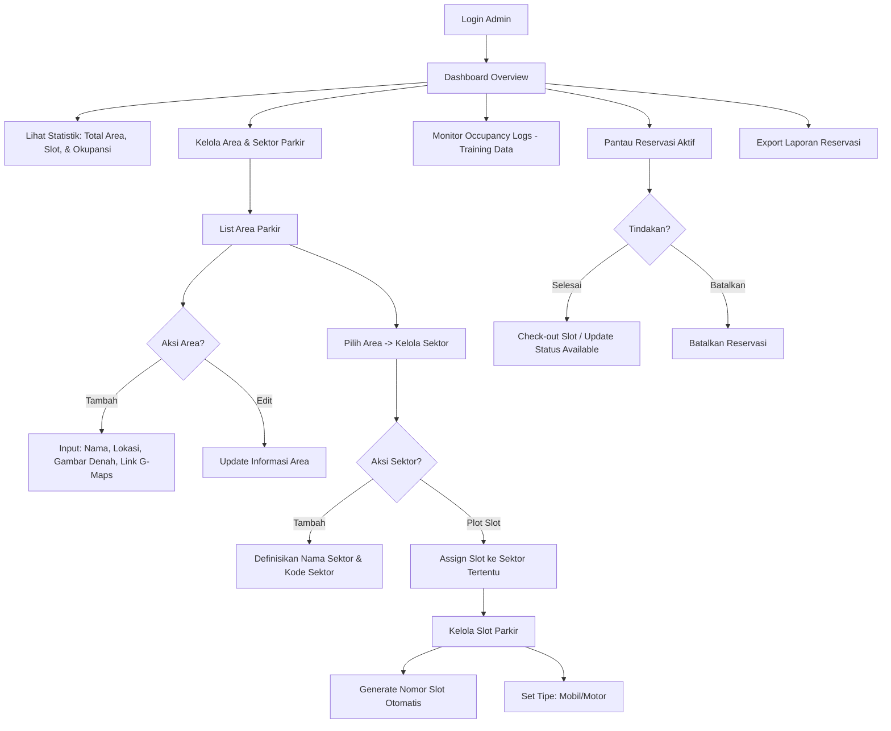
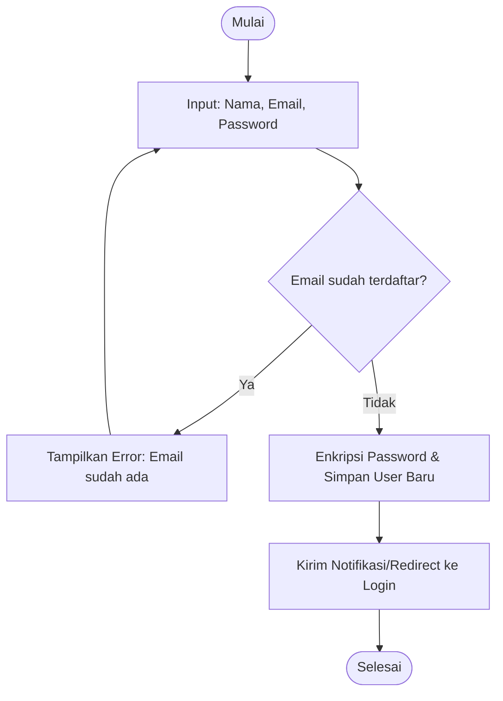
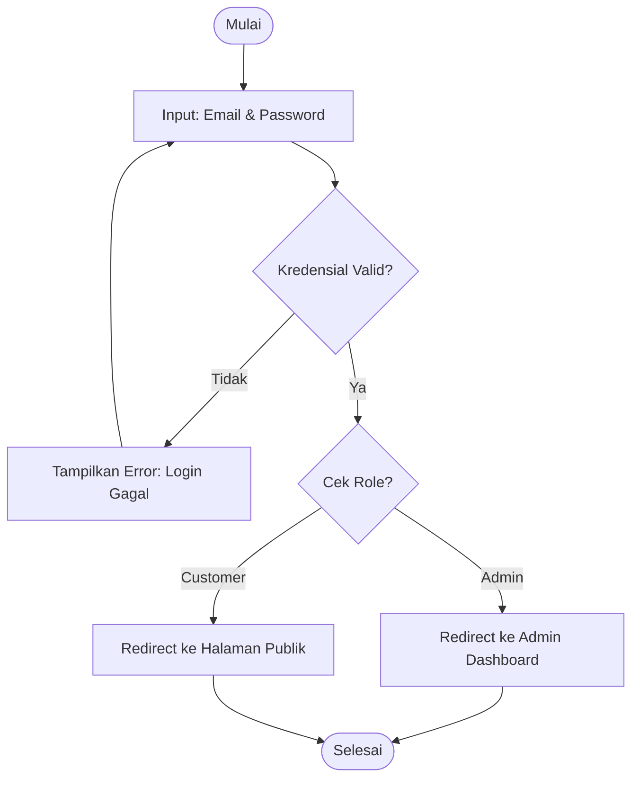
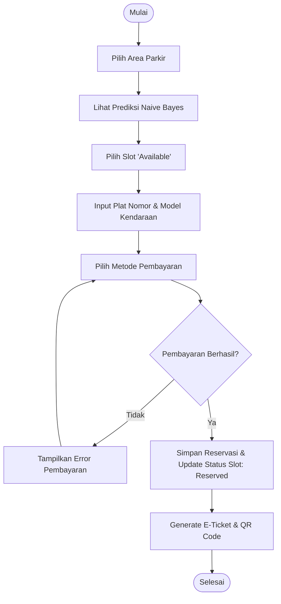
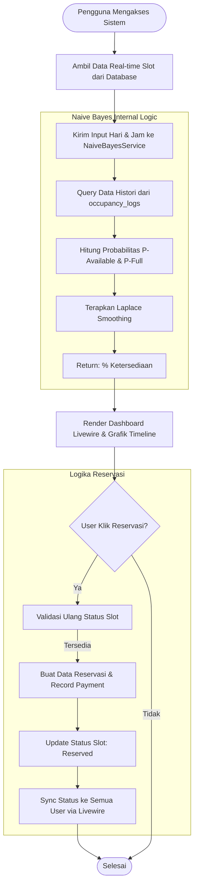

# Rencana Implementasi Sistem Parkir Online (Online Parking System)

Sistem ini dirancang untuk memberikan informasi ketersediaan parkir secara real-time, memprediksi ketersediaan di masa mendatang menggunakan algoritma **Naive Bayes**, dan memungkinkan reservasi slot parkir secara online.

## 1. Arsitektur Teknologi
- **Framework**: Laravel 13.0 (PHP 8.3)
- **UI/Admin Panel**: [Filament v5](https://filamentphp.com/) (Untuk dashboard admin dan user)
- **Real-time**: Laravel Reverb atau Livewire Polling (untuk update ketersediaan)
- **Database**: MySQL/PostgreSQL
- **Prediction Engine**: Custom PHP Implementation of Naive Bayes

## 2. Struktur Database (ERD)

### `users`
- id, name, email, password, role (admin, customer)

### `parking_areas`
- id, name, location, total_slots, description, image

### `parking_slots`
- id, parking_area_id, slot_number, status (available, occupied, reserved), type (car, motorcycle)

### `reservations`
- id, user_id, parking_slot_id, start_time, end_time, status (pending, active, completed, cancelled)

### `availability_logs` (Training Data for Naive Bayes)
- id, parking_area_id, day_of_week, time_slot, occupancy_rate, weather_condition (opsional)

## 3. Fitur Utama & Alur Kerja

### A. Autentikasi (System Login)
Menggunakan **Filament Shield** atau standard Filament Auth.
- **Admin**: Mengelola area parkir, slot, dan memantau reservasi.
- **Customer**: Melihat ketersediaan, melakukan reservasi, dan melihat histori.

### B. Ketersediaan Real-time
- Implementasi status slot yang berubah secara instan saat ada reservasi atau sensor (simulasi) yang mendeteksi kendaraan.
- Visualisasi denah parkir yang interaktif.

### C. Prediksi Naive Bayes
Algoritma ini akan memprediksi apakah parkir akan "Penuh" atau "Tersedia" berdasarkan:
- **Input**: Hari (Senin-Minggu) dan Jam (Pagi, Siang, Sore, Malam).
- **Proses**: Menghitung probabilitas berdasarkan data histori di `availability_logs`.
- **Output**: Persentase kemungkinan ketersediaan.

### D. Reservasi Online
- User memilih slot yang tersedia.
- Sistem mengunci slot (status `reserved`).
- Integrasi payment gateway (opsional/mockup) untuk biaya booking.

## 4. Rencana Langkah Kerja (Roadmap)

1. **Setup Awal**: Instalasi Filament, Spatie Permission, dan konfigurasi database.
2. **Model & Migrasi**: Membuat tabel-tabel inti.
3. **Naive Bayes Service**: Mengembangkan engine prediksi di `app/Services`.
4. **Filament Resources**: Membuat CRUD untuk Area, Slot, dan Reservasi.
5. **Frontend/Customer Portal**: Membuat halaman publik yang elegan untuk cek ketersediaan.
6. **Integrasi Prediksi**: Menampilkan hasil prediksi pada halaman booking.

## 5. User Flow (Alur Pengguna)

Berikut adalah alur interaksi pengguna dalam sistem prediksi dan reservasi parkir:

### A. Customer Flow (Alur Pelanggan)


### B. Admin Flow (Alur Administrator)
Alur ini mendetailkan proses manajemen infrastruktur parkir mulai dari Dashboard hingga pengelolaan Slot.



## 6. Flowchart Detail

### A. Registrasi Akun


### B. Login


### C. Reservasi Slot Parkir


### D. Admin Dashboard (Detail Fitur & Modul)
Flowchart ini mendetailkan setiap modul yang tersedia di panel Admin Filament.

```mermaid
graph TD
    Start([Login Admin]) --> Dash[Dashboard: Ringkasan Stats & Grafik]
    Dash --> Menu{Pilih Modul Dashboard}

    subgraph Infrastruktur [Manajemen Infrastruktur]
        Menu -- Area -- AreaL[List Area Parkir]
        AreaL --> AreaA[CRUD Area: Nama, Lokasi, Denah, Koordinat Maps]
        
        Menu -- Sektor -- SekL[List Sektor Parkir]
        SekL --> SekA[Define Sektor per Area & Kode Sektor]
        
        Menu -- Slot -- SlotL[List Semua Slot]
        SlotL --> SlotG[Generate Slot Otomatis / Manual Plotting]
        SlotG --> SlotT[Set Tipe: Mobil/Motor & Status: Available/Full]
    end

    subgraph Transaksi [Manajemen Reservasi]
        Menu -- Reservasi -- ResL[Monitoring Reservasi Aktif]
        ResL --> ResA{Aksi Reservasi?}
        ResA -- CheckOut --> ResC[Update Status Slot ke Available]
        ResA -- Cancel --> ResX[Batalkan Reservasi & Log Riwayat]
    end

    subgraph DataAI [Data & Prediksi]
        Menu -- Logs -- LogL[Occupancy Logs]
        LogL --> LogV[Verifikasi Data Histori untuk Training Naive Bayes]
        
        Menu -- Laporan -- Rep[Laporan & Analytics]
        Rep --> RepE[Export Data ke Excel/XLSX]
    end

    subgraph Sistem [Manajemen Sistem]
        Menu -- User -- UserL[Kelola Pengguna]
        UserL --> Role[Atur Role & Permission: Admin/Customer]
    end

    Infrastruktur --> Sync[Update Database & Sync Livewire]
    Transaksi --> Sync
    DataAI --> Sync
    Sistem --> Sync
    Sync --> Loop{Kembali ke Dashboard?}
    Loop -- Ya --> Dash
    Loop -- Tidak --> End([Logout])
```

## 7. Alur Logika Fitur (Functional Flowchart)

Diagram ini menjelaskan bagaimana logika internal sistem bekerja dalam memproses data real-time dan prediksi.



---

> [!TIP]
> Fokus utama User Flow ini adalah kemudahan akses informasi **Prediksi Masa Depan** sebelum pengguna memutuskan untuk melakukan reservasi real-time.

---

> [!TIP]
> Kita akan menggunakan Filament untuk membangun interface yang premium dengan usaha minimal namun hasil maksimal (High-End Aesthetics).
